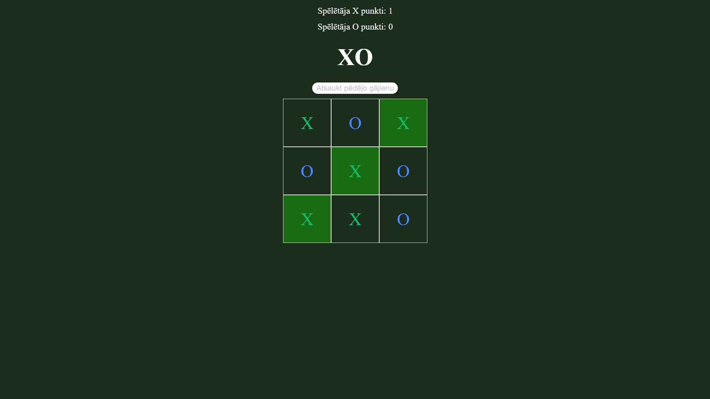
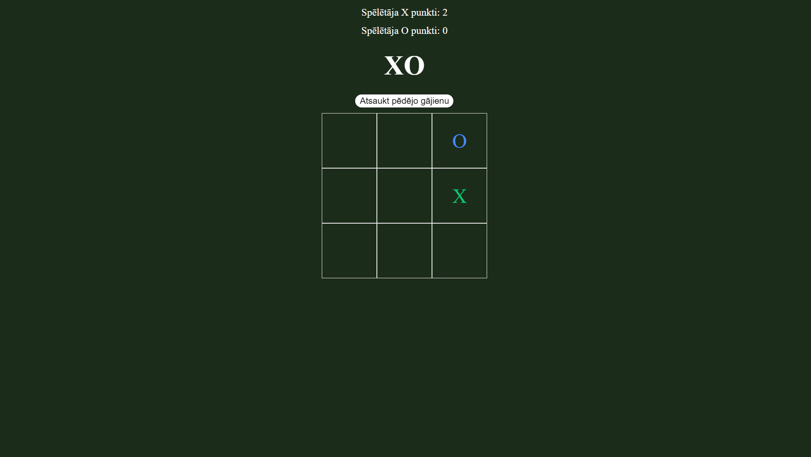

# HTML-CSS-JS
## My school html projects with JS

  
  

### Description

This is projects that i created myself only using picture as example for html page. Howers, transitions and other functions were used.

### Gallery of project

